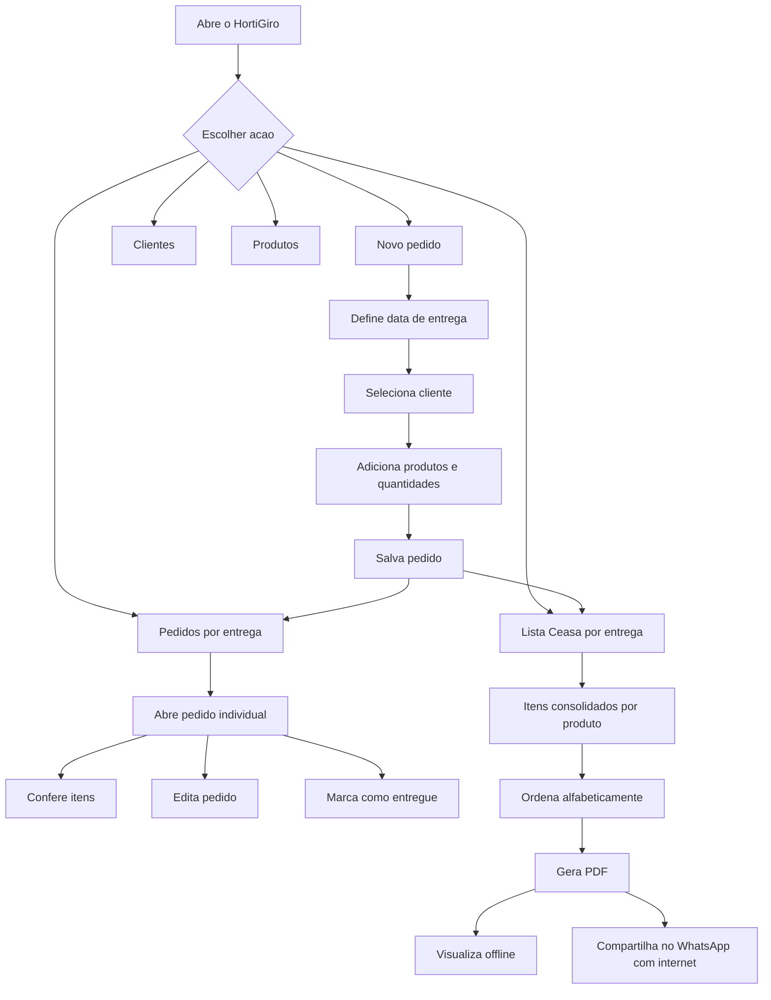
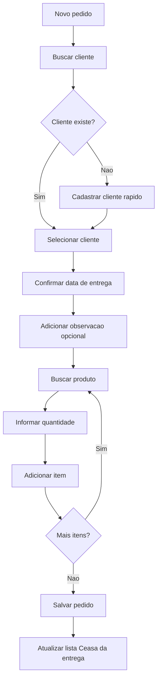
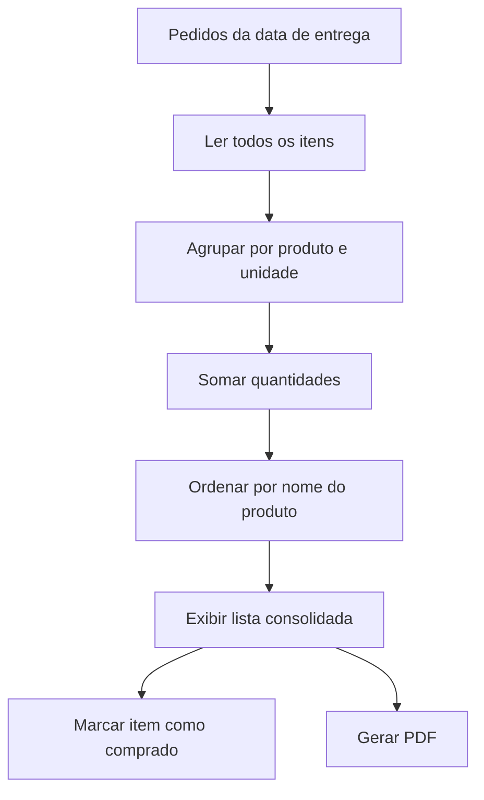
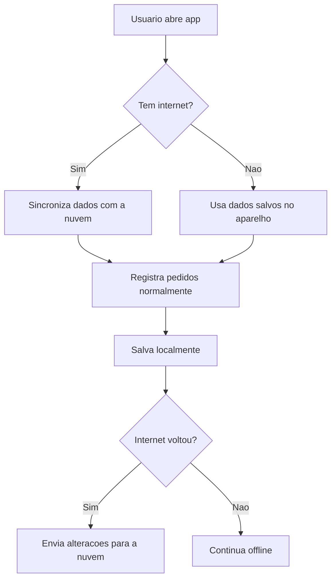

# HortiGiro - Planejamento inicial

## Objetivo

Criar uma PWA para uso interno do dono/funcionarios, focada em registrar pedidos de clientes por telefone e gerar automaticamente uma lista unica de compra para o Ceasa.

## Escopo do MVP

- Cadastro de clientes.
- Cadastro de produtos com unidade padrao.
- Lancamento rapido de pedidos pelo celular.
- Consolidacao automatica da lista final do Ceasa.
- Organizacao por data de entrega.
- Visualizacao de pedido individual por cliente.
- Status simples do pedido: aberto, entregue, cancelado.
- Observacao geral opcional no pedido.
- Geracao de PDF da lista final.
- Compartilhamento do PDF pelo WhatsApp quando houver internet.
- Funcionamento instalavel como PWA em iPhone e Android.

## Decisao sobre unidades

A recomendacao inicial e manter uma unidade padrao por produto e aceitar quantidade decimal.

Exemplos:

| Produto | Unidade padrao | Exemplo no pedido |
| --- | --- | --- |
| Tomate | caixa | 1,5 caixa |
| Banana | caixa | 0,5 caixa |
| Alface | unidade | 20 unidades |
| Ovos | cartela | 2 cartelas |
| Cheiro-verde | maco | 5 macos |
| Morango | bandeja | 12 bandejas |

Assim, "meia caixa" nao precisa ser uma unidade. Ela vira quantidade `0,5` da unidade `caixa`.

Unidades iniciais sugeridas:

- caixa
- unidade
- maco
- bandeja
- duzia
- cartela
- saco
- pacote

## Regra de datas e entregas

O app deve separar duas datas:

- data de lancamento: dia em que o dono registrou o pedido.
- data de entrega: dia em que o pedido sera entregue e que tambem define a lista do Ceasa.

Fluxo informado:

| Pedido feito em | Entrega prevista |
| --- | --- |
| domingo | segunda |
| segunda | terca |
| quarta | quinta |
| quinta | sexta |

A recomendacao e que o app preencha automaticamente a data de entrega como o proximo dia, mas permita editar essa data caso exista excecao.

A lista do Ceasa nao deve ser baseada apenas em "pedidos de hoje". Ela deve ser baseada na data de entrega escolhida.

Exemplo:

- pedidos lancados no domingo para entrega na segunda entram na lista Ceasa de segunda.
- pedidos lancados na segunda para entrega na terca entram na lista Ceasa de terca.

Isso tambem ajuda no historico, porque depois sera possivel consultar:

- pedidos lancados em uma data.
- entregas previstas para uma data.
- lista Ceasa de uma data especifica.

## Tecnologia recomendada

### Frontend/PWA

- React
- TypeScript
- Vite
- PWA com service worker
- IndexedDB para dados locais/offline
- Biblioteca de PDF para gerar a lista do Ceasa

Motivo: cria um app leve, rapido, instalavel no celular e com boa base para evoluir.

### Backend/nuvem recomendado para a fase 2

Opcao recomendada: Firebase

- Firebase Hosting para hospedar a PWA.
- Firebase Authentication para login.
- Firestore para salvar clientes, produtos e pedidos na nuvem.
- Suporte a uso offline no Firestore, importante para o fluxo do cliente.

Motivo: para um app interno com poucos usuarios, tende a ser simples de manter e pode comecar pequeno.

### Alternativa

Supabase

- Boa escolha se o projeto precisar de banco relacional SQL/PostgreSQL.
- Bom para relatorios mais avancados no futuro.
- Offline exige mais implementacao propria do que Firebase.

## Papel do GitHub

Usaremos GitHub como repositorio do codigo.

Fluxo sugerido:

1. Codigo fica no computador durante o desenvolvimento.
2. Alteracoes sao versionadas com Git.
3. Projeto e enviado para um repositorio no GitHub.
4. Hospedagem faz deploy automaticamente a partir do GitHub.

Isso permite:

- Historico seguro das alteracoes.
- Voltar versoes se algo quebrar.
- Trabalhar com etapas organizadas.
- Publicar o app com mais controle.

## Fluxo geral do app

## Fluxo de lancamento de pedido

## Fluxo da lista Ceasa

## Fluxo offline e nuvem

## Telas do MVP

### Inicio

- Botao principal: Novo pedido.
- Resumo da proxima entrega: quantidade de pedidos, clientes atendidos, itens na lista Ceasa.
- Acesso rapido: Pedidos por entrega, Lista Ceasa, Clientes, Produtos.

### Novo pedido

- Busca de cliente.
- Data de entrega preenchida automaticamente e editavel.
- Campo de observacao geral.
- Busca de produto.
- Quantidade com botoes rapidos: -0,5, +0,5, +1, +2.
- Lista de itens adicionados.
- Botao salvar.

### Pedidos por entrega

- Seletor de data de entrega.
- Lista de clientes com pedido para a entrega selecionada.
- Status: aberto, entregue ou cancelado.
- Acesso ao pedido individual.
- Edicao do pedido.

### Lista Ceasa

- Lista consolidada por produto.
- Baseada na data de entrega selecionada.
- Ordenacao alfabetica.
- Checkbox para marcar item como comprado.
- Gerar PDF.
- Compartilhar PDF pelo WhatsApp.

### Clientes

- Cadastrar cliente.
- Editar cliente.
- Buscar cliente.
- Ver historico de pedidos do cliente.

### Produtos

- Cadastrar produto.
- Editar unidade padrao.
- Ativar/inativar produto.
- Buscar produto.

## Modelo de dados inicial

### Cliente

- id
- nome
- telefone
- endereco
- observacaoPadrao
- ativo

### Produto

- id
- nome
- unidadePadrao
- ativo

### Pedido

- id
- clienteId
- dataLancamento
- dataEntrega
- status
- observacaoGeral
- criadoEm
- atualizadoEm

### ItemPedido

- id
- pedidoId
- produtoId
- produtoNome
- quantidade
- unidade
- observacao

## Fases sugeridas

### Fase 1 - Prototipo navegavel

- Criar a interface com dados de exemplo.
- Validar telas e fluxo no celular.
- Ajustar nomes, botoes e ordem das informacoes.

### Fase 2 - MVP local/offline

- Salvar clientes, produtos e pedidos no navegador.
- Gerar lista Ceasa real por data de entrega.
- Gerar PDF.
- Instalar como PWA no celular.

### Fase 3 - Nuvem e autenticacao

- Criar login.
- Hospedar app.
- Sincronizar dados com backend.
- Criar backup.

### Fase 4 - Melhorias

- Historico por cliente.
- Repetir pedido anterior.
- Relatorios simples.
- Mais usuarios, se necessario.
- Exportacao avancada.

## Recomendacao de caminho

Comecar com React + TypeScript + Vite, criando primeiro um prototipo navegavel. Depois adicionamos persistencia local/offline. Em seguida, se o fluxo estiver validado, conectamos Firebase para hospedagem, login e backup.
